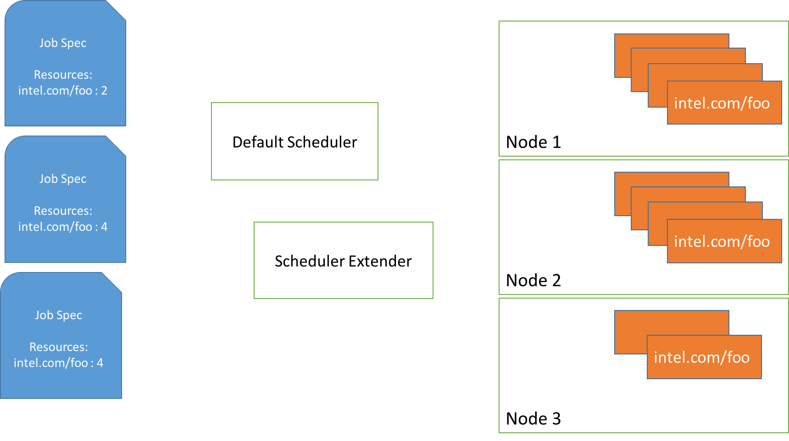
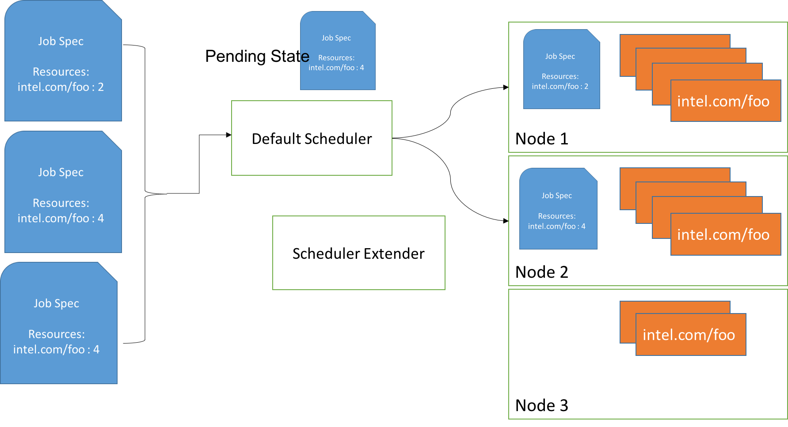
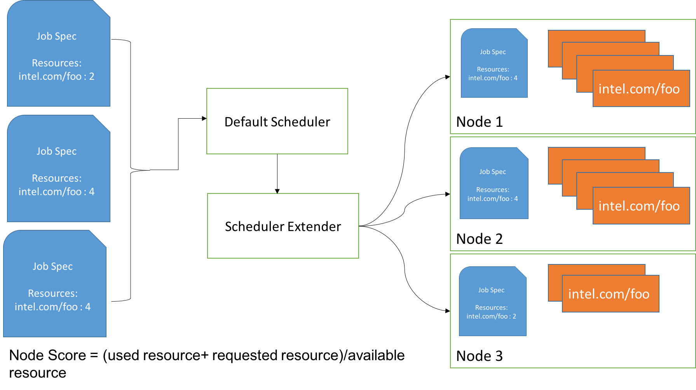

# Resource Bin Packing Priority Function

## Table of Contents

- [Summary](#summary)
- [Motivation](#motivation)
  - [Goals](#goals)
  - [Non-Goals](#non-goals)
- [Proposal](#proposal)
  - [User Stories](#user-stories)
    - [Story 1](#story-1)
- [Design Details](#design-details)
  - [Examples](#examples)
  - [Test Plan](#test-plan)
  - [Graduation Criteria](#graduation-criteria)
- [Implementation History](#implementation-history)

## Summary

Resource Bin Packing Priority Function allows users to use the best fit polices during scheduling. It allows users to apply [bin packing](https://en.wikipedia.org/wiki/Bin_packing_problem) on core resources like CPU, Memory as well as extended resources like accelerators.

## Motivation

While running Machine Learning workloads on kubernetes which use accelerator devices the default scheduler spreads pods across nodes resulting in fragmentation of extended resources. This fragmentation prevents scheduling pods with larger device resource requirements, and they remain in pending state.

### Goals

- Schedule Jobs using BestFit Policy using Resource Bin Packing Priority Function
- Reduce Fragmentation of scarce resources on the Cluster

### Non-Goals

-

## Proposal

The plan is to add `resource_bin_packing`  as an optional priority function. Add another argument resources of type `map[v1.ResourceName]int64{}` .This would allow users who want to bin pack a resource to use the function by setting the argument resources which would require them to specify weights for bin packing. For example

```yaml
"priorities": [
    ... {
        "name": "ResourceBinPackingPriority",
        "weight": 5,
        "argument": {
            "resourceBinPacking": {
                "resources": [{
                    "resource": "intel.com/foo",
                    "weight": 5
                }, {
                    "resource": "intel.com/bar",
                    "weight": 2
                }, {
                    "resource": "cpu",
                    "weight": 1
                }]
            }
        }
    ],

```

The node score would be calculated as (requested+used) / available. The weights would be used to calculate the resulting node score in the following way.

```go
resources := make(map[v1.ResourceName]weight)
nodeScore := 0
weightSum := 0
for resource, weight := range resources {
  nodeScore += ((requested[resource]+ used[resource])/available[resource]) * weight
  weightSum += weight
}
nodeScore = (nodeScore / weightSum)* 10
```

### User Stories

#### Story 1

Let's consider a cluster with `intel.com/foo` as a scarce resource. A user needs to submit 3 `jobs` with specs as shown below



#### Default Behavior

The default scheduler in most cases will schedule the Jobs as follows as there is no priority function for an extended resource for bin packing.



#### Extender Resource Scheduler Behavior

The Scheduler should submit the 2 resource job on Node 3 as the utilization is higher. This would reduce the fragmentation of extended resource and reduce jobs in the pending state.




### Test Plan

_To be filled until targeted at a release._

### Graduation Criteria

_To be filled until targeted at a release._

#### Examples

```
Requested Resources

intel.com/foo : 2
Memory: 256MB
CPU: 2

Resource Weights

intel.com/foo : 5
Memory: 1
CPU: 3

Node 1 Spec

Available:
intel.com/foo : 4
Memory : 1 GB
CPU: 8

Used:
intel.com/foo: 1
Memory: 256MB
CPU: 1


Node Score:

(((2 + 1)/4)*5 + ((256 + 256)/1024)*1 + ((2 + 1)/8)*3) / (5 + 1 + 3) * 10 

= 6


Node 2 Spec

Available:
intel.com/foo: 8
Memory: 1GB
CPU: 8

Used:

intel.com/foo: 2
Memory: 512MB
CPU: 6

(((2 + 2)/8)*5 + ((256 + 512)/1024)*1 + ((2 + 6)/8)*3) / (5 + 1 + 3) * 10

= 7
```

## Implementation History

- 2019-03-11: Initial KEP sent out for review.